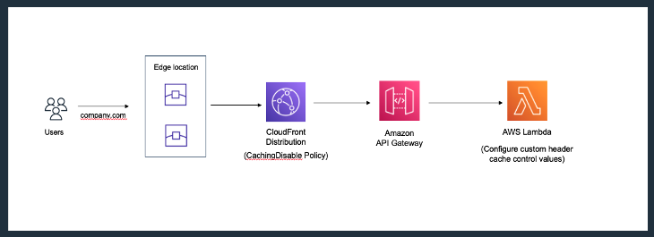
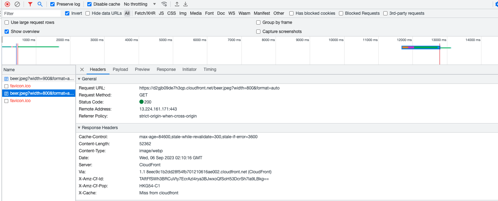
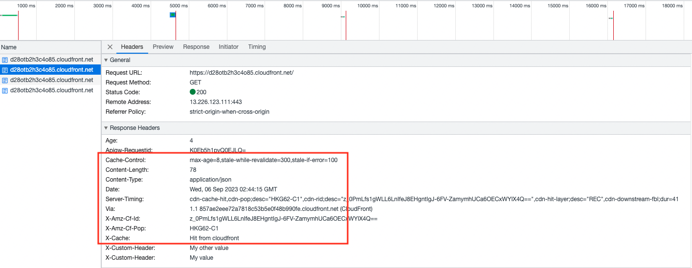
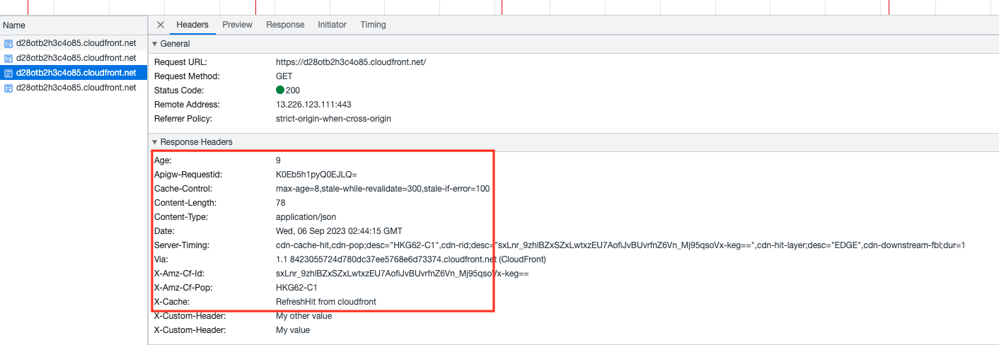
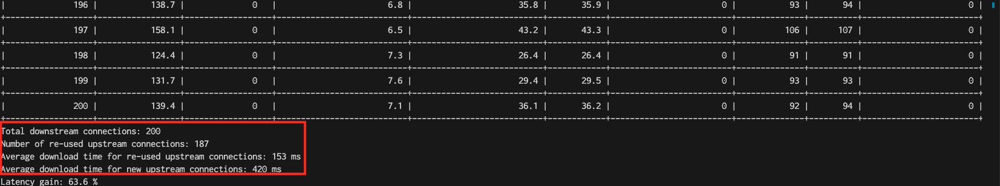

# Leveraging the Power of CloudFront and Edge Computing

This repository demonstrates 03 scenarios:
- Scenario #1: Image optimization with CloudFront Function and Lambda@Edge.
- Scenario #2: Stale-while-revalidate and stale-if-error cache control directives.
- Scenario #3: Test persistent connections in CloudFront distribution with origin.


<div align="center">Figure 1. Image optimization </div>
</br></br>


<div align="center">Figure 2. Cache control directives </div>
</br></br>

# Usage
## Prerequiste
Please make sure you have the following installed in your client:
- Terraform version >= 1.45
- NodeJS version 16.x
- S3 bucket and a DynamoDB table for storing Terraform backend
- curl and PycURL
## Get Started
### Install node package for Lambda@Edge function, from root directory, run:
`cd lambda`
#### For MacOS:
`npm install --platform=linux --arch=x64 sharp`
#### For Linux and Windows:
`npm install`

Keep in mind that when you update the lamdba@edge function code, you should repeat the steps above.
### Provision infrastructure, from root directory, run:
Terraform source code for provisioning AWS resources is inside the infrastructure folder. Before running Terraform, you should update values in the following files based on your use case:

- versions.tf: Update your s3 bucket name and DynamoDB table name for your remote Terraform backend.
- terraform.tfvars:
  - testing scenario #2: set "test_stale_object = true"
  - testing scenario #3: set "test_stale_object = false"
  
Then, running terraform commands in root directory:

```cd infrastructure```

```terraform init```

```terraform apply```

### How to test
- Scenario #1: Openning your browswer, enter your CloudFront distribution domain name:
```
https://<your_distribution_domain_name>/<your_image.extension>?width=900&format=auto
```
You can change value of width for various size of object.

- Scenario #2: Openning your browser, enter your CloudFront distribution domain name:

```
https://<your_distribution_domain_name>
```

- Scenario #3: Running the below command in root directory:
```
python3 timing.py <your_distribution_domain_name> -n <number_of_client_requests>
```

### Verifying the testing results:
Your testing result will look something like this:
- Scenario #1:


<div align="center"></div>

- Scenario #2:


<div align="center"></div>


<div align="center"></div>

- Scenario #3:


<div align="center"></div>


