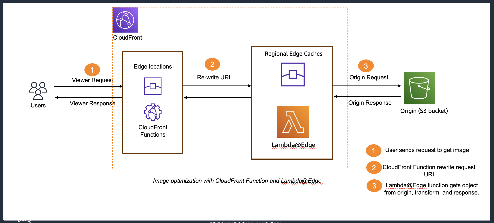

# Leveraging the Power of CloudFront and Edge Computing

This repository demonstrates 02 scenarios:
- Image optimization with CloudFront Function and Lambda@Edge
- Stale-while-revalidate and stale-if-error cache control directives

Figure 1. Image optimization 

  

  

Figure 2. Cache control directives

